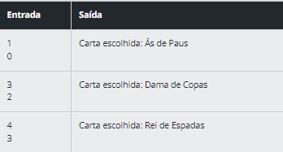

# Coding the Future Avanade - Desafio de C#

## Desafio 3 - [2/3]

Você é um inventor de robôs excêntrico e engraçado, que decidiu criar seu próprio exército de robôs para ajudá-lo em suas tarefas diárias. Para isso, você precisa desenvolver uma classe `Robo` que permita que cada um dos seus robôs tenha características únicas. Crie seu próprio robô personalizado, escolhendo seu nome, modelo e ano de fabricação, e veja seu exército de robôs engraçados tomar forma diante dos seus olhos!

Você precisa criar uma classe `Robo` que possua um construtor que inicialize a classe com as características do robô (nome, modelo e ano de fabricação). Além disso, você precisa implementar métodos para exibir as características do robô.

Escreva uma classe `Robo`, que possua os seguintes atributos e métodos:

- Três atributos: `nome`, `modelo` e `ano de fabricação`;
- Construtor: deverá inicializar a classe com o `nome`, `modelo` e `ano de fabricação`;
- Método chamado `exibirInformacoes`: que não receba parâmetros e exiba na tela as características do robô.

Seu programa deve solicitar ao usuário o nome, modelo e ano de fabricação do robô e criar um objeto `Robo` com essas informações. Em seguida, deve chamar o método `exibirInformacoes` para exibir as características do robô.

### Entrada:
A entrada deverá receber os atributos do robô, conforme exemplo abaixo:

- `nome`: referente ao nome do robô (string).
- `modelo`: referente ao modelo do robô (string).
- `ano`: referente ao ano da criação do robô (int).

**IMPORTANTE:** A entrada deverá seguir a ordem informada acima.

### Saída:
O código deverá retornar uma mensagem (string) informando o nome, modelo e ano do robô criado, de acordo com o que foi recebido como entrada. Veja como exemplo a entrada recebida abaixo:

